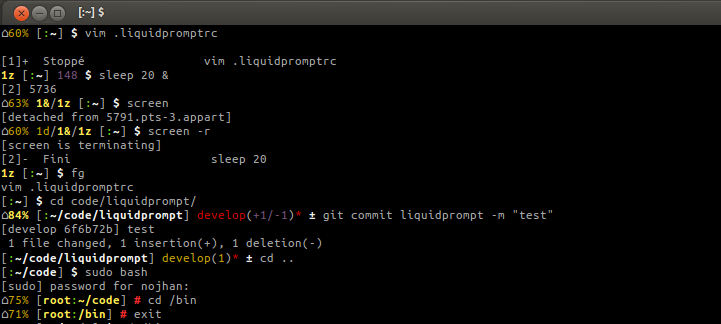
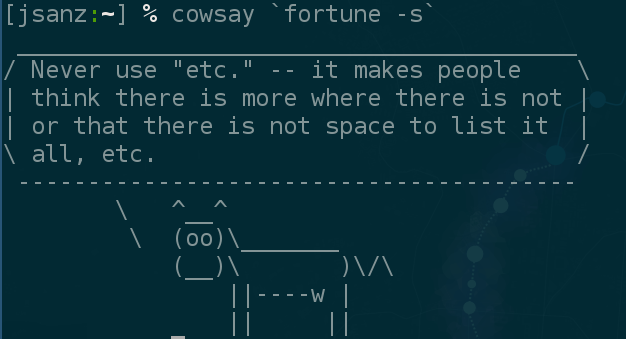
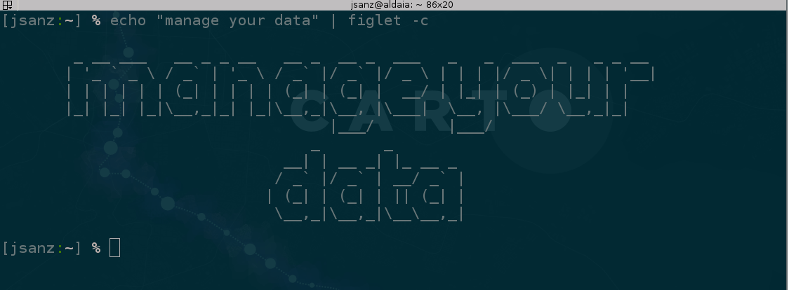

# How I use the command line <!-- .element style="font-size:2em"-->

Jorge Sanz · jorge@carto.com · 2017-04-04

http://bit.ly/170404-cli


---

# Why


___

# Agenda

* Terminals
* Viewing and finding things
* Handling data

---

# Terminals


___

### `bash` versus `zsh`

* `bash` provides more compatibility
* `zsh` provides better user experience
   * browsing your history
   * sharing history accross terminals
   * better autocompletion
* [Differences between bash and zsh](https://www.quora.com/What-is-the-difference-between-bash-and-zsh)
___

### browse your history

* Increase the value of `HISTSIZE`
* `CTL + R` to search over terminal history (and repeat)
* `zsh`: start typing command and go up
* `!!` to run the last command
* `^before^after` change `before` on the last command by `after`
___

### moving around

* `CTL + L`: clean the screen
* `CTL + A`, `CTL + E`: go to the begin/end of the line
* `CTL + S` and `CTL+Q`: stop and resume output
* More [Bash and zsh shortcuts](http://www.geekmind.net/2011/01/shortcuts-to-improve-your-bash-zsh.html)

___

### scripting

* Automate stuff (for big stuff use Python, Ruby, etc)
* You can create functions, check variables, make calculations
* Control structures: `if`, `for`, `while`, etc

```sh
while 1; do
  echo `date`;
  curl -s "${CARTO_API_URL}v2/sql/job/${JOB_ID}"
  sleep 20
done
```
___

### Piping and redirections

* Use the pipe `|` to chain commands<br/>
`cat /etc/hosts | grep localhost`
* Use redirections `>` to write the output into a file<br/>
`cat /etc/hosts > myhosts`

___

### Customizing your prompt

* The prompt can provide context
* I use [`liquidprompt`](https://github.com/nojhan/liquidprompt)



---

# Viewing and finding things


___

### `head` and `tail`

* Print the beginning and end of a file <br/>`head -n10 myfile.csv`
* Print a file that is changing <br/> `tail -f /var/log/syslog`

___

### `find`

Find stuff and do things with them

```sh
$ find . -name ".DS_Store" -type f -delete
$ find . -name ".gitignore" -type f -exec cat {} \;
```

[35 `find` examples](http://www.tecmint.com/35-practical-examples-of-linux-find-command/)

___

### `awk`

* Programming language to process files
* I've only used it to process tabular data
* [`awk` tutorial](https://www.tutorialspoint.com/awk/awk_quick_guide.htm) (randomly selected)

```
$ head -n10 populated_places.csv | \
  awk -F ","  '{print $1 "," $7 "," $8}'
```

___

### `sed`

* Great for working with text files:
  * replacing texts
  * finding patterns
  * working with line numbers
* `sed` examples: [1](https://www.ibm.com/developerworks/library/l-sed1/), [2](https://www.ibm.com/developerworks/library/l-sed2/)
  and [3](https://www.ibm.com/developerworks/library/l-sed3/)

```sh
$ sed -n -e '/\#.*/p' /etc/hosts # Print comments
$ cat /etc/hosts | \
  sed -e '/\#.*/d' | \ # comments
  sed -e '/^\s*$/d' | \ # blank lines
  sed -e 's/[\ \t].*//g' # everything after a space or tab
$ sed -n '2,10p' my.csv # print a range
```
___


___

### j (autojump)

* [`j`](https://github.com/wting/autojump) is a utility to move around your file system

```sh
$ sudo apt-get install autojump
$ brew install autojump
$ j carto-workshop
$ jo desktop
```

___

### pigmentize

* Pretty-print source code files with `pygmentize myscript.py`
* You can create an HTML output

```sh
$ alias ccat='pygmentize -g'
$ ccat ~/src/sdks/carto-python/carto/auth.py
```

___

### The [silver searcher](https://github.com/ggreer/the_silver_searcher)

* Powerful source-code search utility

```sh
$ apt-get install silversearcher-ag
$ brew install the_silver_searcher
$ j carto-workshop
$ ag hexbins
```

---

# Handling data



___

### split

* Break CSV files into parts based on size, number of parts, number of lines, etc.

```sh
$ split -a2 --numeric-suffixes=01 \ #use numeric suffix
  --additional-suffix=.csv -l800000 \ # 800K
  gecat.csv "gecat_split_" # input and result
```

___

### jq

* JSON processor
* Mostly to get information down
* Also for refactoring

```sh
$ carto_named_template test_named_map | \ #get a template
  jq ".template.layergroup.layers[].options.sql" | \ # process to get the SQL
  sed -e "s/null//g" -e "s/\"//g" -e "s/\\\n/\n/g" | \ # remove nulls and "
  pygmentize -l sql # colour!
```
___

### ogr2ogr, ogrinfo

```sh
$ ogrinfo -summary mydataset mylayer
$ ogr2ogr -f "GPKG" ne_10m_admin_0_countries.gpkg \
     ne_10m_admin_0_countries.shp
```
___

### [hub](https://hub.github.com/)

* `git` extension from GitHub

```sh
$ alias git=hub
$ git clone CartoDB/Support
$ git browse -- issues
$ # work on some stuff
$ git pull-request -m "my new pull request"
```
---

# Other stuff

* csvkit: `csvcut`, `csvlook`, ...
* `pigz`
* `tr`, `sort`, `uniq`, `fold`, `wc`
* `json2csv`
* Learn the basics of how to use `vim`: moving, c&p at least
* Data Science at the Command line - Jeroen Janssens

---


Jorge Sanz · jorge@carto.com · 2017-04-04

http://bit.ly/170404-cli


