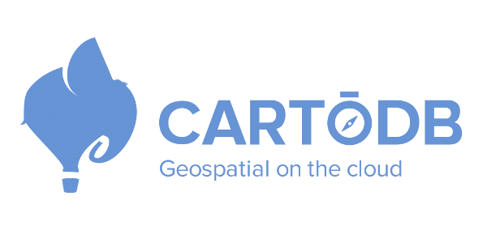
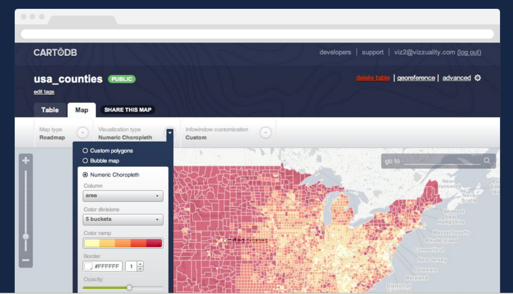
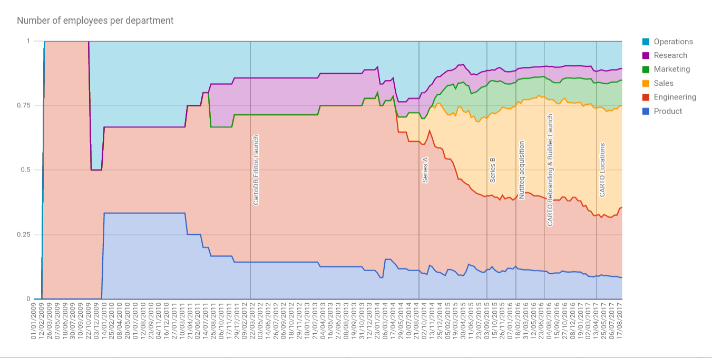
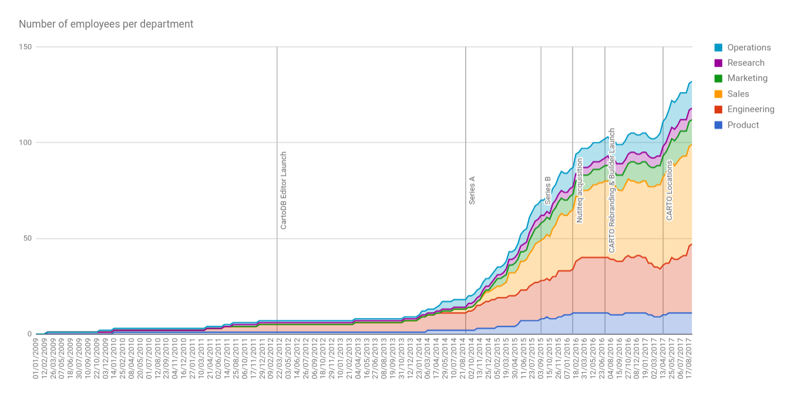

# Solutions Engineering at CARTO <!-- .element style="font-size:2em;"-->

Jorge Sanz · jorge@carto.com · 2017-08-16

http://bit.ly/170816-carto-solutions

___

## Agenda

* **CARTO**: from consultancy to start-up
* **Evolution** of the solutions engineering team
* Solutions in **2017**

---

## Origins

* **Consultancy** firm started  by [@jatorre](https://twitter.com/jatorre)
  and [@saleiva](https://twitter.com/saleiva) in 2008

 <!-- .element: style="width:30%;" -->
 <!-- .element: style="width:40%;" -->

___

## Origins

* Focus on **biodiversity**
* Many projects with **geospatial** component
* Some R&D funded projects
* Using **only FOSS4G** software
* Few people, **fast** and **frictionless** development

___

 <!-- .element: style="background-color:white;width:60%;" -->

[*Gettin' it done*](http://cartohq.tumblr.com/post/56176131106/gettin-it-done)

---

 <!-- .element: class="noborder" style="background-color:white;width:40%;" -->

* Always the same **geospatial stack**
* Convert that stack into a **product**
* Offer it as a **freemium SaaS**
* Enter the start-up life cycle
* Released in 2012

___

 <!-- .element: class="noborder" style="width:80%" -->

---

## 2011-2013

* Pure product **development**
* No specific **sales role** (except @jatorre)
* By the end 2013, a **9** people (male) company

___

 <!-- .element: style="width:75%;" -->

---

## Solutions Engineering at these early years

* Mostly done by the **technical people**
* **First** Solutions Engineers:
  * @jatorre, @saleiva, and @javisantana
* Without any formal **process**
* **Support** is provided  by the Tech team
  * Teddy Bear

---

## 2014 growing 

* Hiring new profiles, first **sales reps**, **operations managers**, and full **US team**
* First **Enterprise** clients
* First organization division:
  * **Technology**: develop a B2C product
  * **Community**: research, engage and support
  * **Sales**: maintain current clients and get new ones
  * **Operations and Finance**: _keep us out of jail_
* First two sales engineers: **Sander** and **Jorge**
  * They leave quickly ¯\\\_(ツ)\_/¯
* By the end 2014, a **30** (23/7) people company

___

|   |    |
|:-:|:-:|
| Sander  | Jorge  |

---

## 2014: Support team starts

* **Carla Iriberri** is our first **Support Engineer**
  * First **woman** in the company
* Inside the **Community** Team
* Quickly needs help, end of 2014
  * **Michelle** and **Stephanie** join from NYC
___

|  |   |   |
|:-:|:-:|:-:|
| Carla  | Michelle  | Stephanie  |

---

## 2015: Solutions Engineering team starts

* First half of 2015
  * Two engineers in NYC: **Chris**, **Andrew**
  * Two engineers in Spain: **Dani**, and me
___

|   |    |   |
|:-:|:-:|:-:|
|  Chris | Andrew  | Dani  |
___

## 2015: Solutions Engineering team starts

* Last quarter of 2015
  * Two new Support Engineers in Madrid:
     * **Oriol**, and **Ernesto**
  * Two more SE:
    * **Abel** in Madrid, **David** in Denver

___

|   |   |
|:-:|:-:|
|  Oriol | Ernesto  |
___

|   |   |
|:-:|:-:|
|  Abel  | David |
___

## 2015: Solutions Engineering team starts

* By the end of 2015, **84** (64/20)

---

## Solutions team duties

* **Technical** selling
* Integrations, **prototypes**
* **Level 2** of Support: weekly rotation to help Support
* **Trainings** for partners and enterprise users
* **Post-sales** technical support for enterprise users
* Anything else couldn't tackled by technology folks

---

## 2016: Company reorganization

* Sales roles are better defined
* **Community** team is split:
  * A new **Research & Data** team is created
  * Pure community roles go to **Marketing**
  * **Support** is moved inside **Solutions**
* **Technology** is reorganized  into **Product** and **Engineering**
* By the end of 2016, **105** (85/20)

---

## 2016: Solutions Engineering now also does Support

* **Three** functional groups:
  * **technical sellers**, **engineering** and **support**
* Some of us **multitask** over different groups
* We are a **distributed** team:
  * San Francisco, Denver, Philadelphia, NYC (2)
  * Madrid (3), Valencia, Valladolid

---

## 2016: Solutions Engineering now also does Support

* Start doing Enterprise Support: **on-call rotation**
* Improvement of **processes**, specially on the interactions with our Sales Representatives
* The team does not change a lot
  * **Chris** leaves, **Ramiro** joins
___

Ramiro
---

## 2017 Solutions gets into consultancy projects

* Some accounts have **very specific needs**  that partners cannot do
* Solutions to the rescue; engineering evolves to a **professional services** division
* New members:
  * Professional Services: **Alberto** and **Alejandra**
  * Support: **Alexander**
  * Pre-sales: **Danny**, **Steve**, **Jimena** and **Rodrigo**

___

|    |   |  <!-- .element: style="width:400px;min-height:250px;" -->  |
|:-:|:-:|:-:|
| Alberto  | Alejandra   | Alexander   |
___

|    |   |
|:-:|:-:|
|  Danny | Steve |

___

|  |  |
|:-:|:-:|
| Jimena | Rodrigo |

---

## Responsibilities are settling

* We are **the glue** between our product developers  and the rest of the company
* More **focused roles** and less jacks of all trades
* Support can handle L1 and **most of L2** tickets
* Better **trainings** procedures and content
* Efforts to reduce **noise** and **friction** on communications

---

## Responsibilities are settling

* Madrid Solutions team is leading  some **Community efforts**:
  * **CartoCamp** Madrid
  * Participating in **Geoinquietos** Madrid
  * Colaborations with other local groups and entities
* Better **post-sales** coordination with the new **Customer Success** team

---

## Locations

* **Brazil**: Sao Paulo
* **USA**: San Francisco, Denver, Philadelphia, Washington DC, NYC (2)
  * Tech seller in DC? [Apply!](https://boards.greenhouse.io/cartodb/jobs/660167)  
* **Canada**: St John’s Newfoundland (til September)
* **Spain**: Madrid (5), Valencia (2), Valladolid
* **UK**: London

---

## Backgrounds

* Mostly with a **geospatial background**
* Some come with **pre-sales** experience,  others from **consultancy**
* Pre-sales tend to be more **seasoned** engineers,  while Support are **younger** (except me)

---

## How we do sales eng.?

* **Clear process** for Sales Reps to ask for help
* Only **after qualification**:
  * don’t get into the opportunity too soon
* An SE is assigned for the full opportunity process
* **Work closely** with the Sales Rep., listen client recommendations, help on the best sales approach, assure CARTO is a good fit
* **Develop** proofs of concept and tailored demos

---

## How we do support?

* **Strong asynchronous** focus: no phone, no chat, only e-mail to attend even our own workmates
* Synchronous communications (chat or phone) only for **urgent** stuff
  * *Planes falling from sky*
  * *Most of our MRR may be in jeopardy* (@santana)
* Internally we use:
  * **Chat**: slack
  * **Audio/video**: slack, google meet, goto meeting/webinar, whatever fancies our clients and our hipster sales people (*Skype for what?*)

---

## How we do support?

* Inputs:
  * Mostly attending our **ticketing system**
  * But also **GIS Stack Exchange** `carto` tag
  * And **Google Group** (but this is normally attended by Engineering folks)
* Using **GitHub Issues** to pass tasks between us over timezones and communicate with our developers

---

## How we do support?

Recently Engineering has developed a new procedure called **Response Team** (sort of *Teddy Bear v2*) where a group of engineers rotates every two weeks to focus only on helping to **fix issues** raised by us (and by proxy the full company).

---

## Closing

___

https://carto.com/jobs

---

# THANKS!

 <!-- .element: style="width:125px;min-height:125px;" -->
<!-- .element: style="width:125px;min-height:125px;" -->
<!-- .element: style="width:125px;min-height:125px;" -->
<!-- .element: style="width:125px;min-height:125px;" -->
<!-- .element: style="width:125px;min-height:125px;" -->
<!-- .element: style="width:125px;min-height:125px;" -->
<!-- .element: style="width:125px;min-height:125px;" -->
<!-- .element: style="width:125px;min-height:125px;" -->
<!-- .element: style="width:125px;min-height:125px;" -->
<!-- .element: style="width:125px;min-height:125px;" -->
<!-- .element: style="width:125px;min-height:125px;" -->
<!-- .element: style="width:125px;min-height:125px;" -->
 <!-- .element: style="width:125px;min-height:125px;" -->
<!-- .element: style="width:125px;min-height:125px;" -->
<!-- .element: style="width:125px;min-height:125px;" -->

___

<iframe src="https://docs.google.com/presentation/d/1nArljSCxUyoGLYgn7E3UnMsJuvNeOoNMVWALpUpKjT8/embed?start=false&loop=false&delayms=3000" frameborder="0" width="960" height="569" allowfullscreen="true" mozallowfullscreen="true" webkitallowfullscreen="true"></iframe>

___

# THANKS!

Jorge Sanz · jorge@carto.com · 2017-08-16

http://bit.ly/170816-carto-solutions

