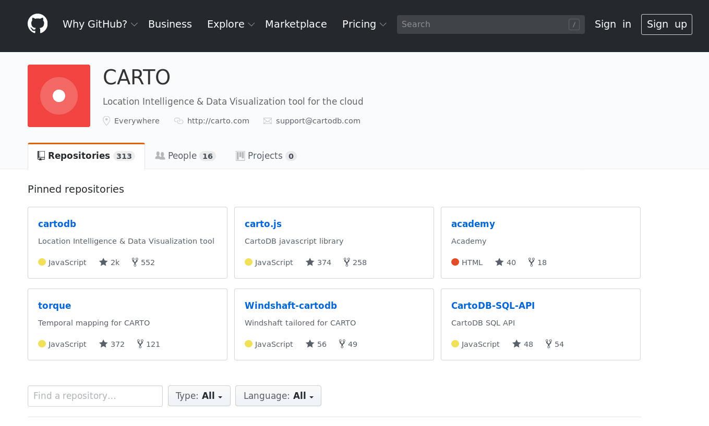
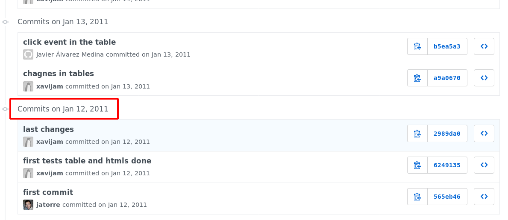
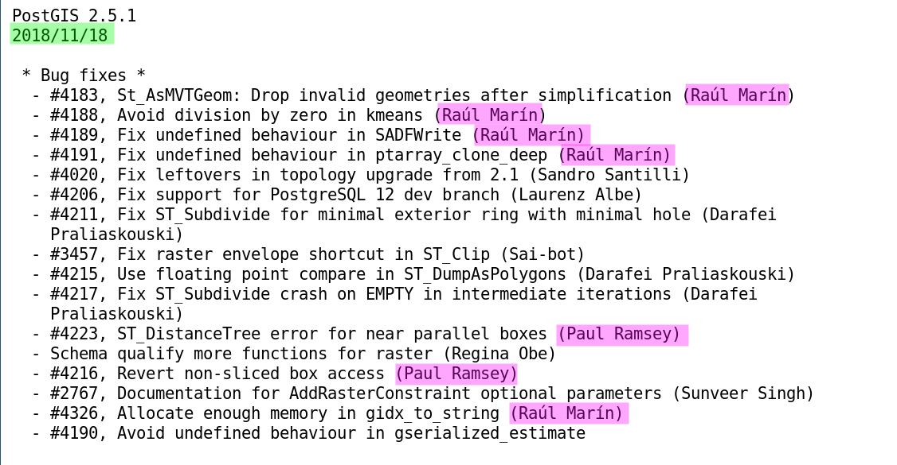
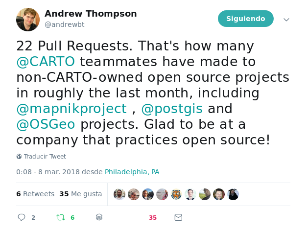

## <!-- .element class="noborder" style="height:2.2em;vertical-align:middle;" -->  ♥️ FOSS4G

Jorge Sanz · [@xurxosanz](https://twitter.com/xurxosanz)  
Coordinador de Soporte

Note:

* Pequeña presentación de quién soy
* En CARTO vivimos dentro del Open Source

---
<!-- .element style="padding:0;" -->

<!-- .element style="border:0;margin:0;padding:0" -->

Note:

CARTO arrancó alrededor de 2011 como un proyecto interno y autofinanciado para crear un producto de visualización de mapas. Con el tiempo la idea se validó y se consiguió inversión externa para poder escalar el equipo y el producto bajo la clásica evolución de una *start up*.

En la actualidad la organización está formada por más de 100 profesionales, 40 en el área de ingeniería y producto.

---

[github.com/CartoDB](https://github.com/CartoDB)

Note:

Toda el desarrollo de CARTO se realiza en la organización `CartoDB` en Github. Por supuesto hay algunos repositorios privados para cosas relacionadas con clientes sobre todo, pero la gran mayoría de la actividad se realiza en abierto.

En CARTO se trabaja alrededor de lo que se conocen como revisiones de código, donde los compañeros se auditan a sí mismos para mejorar y corregir errores. No sólo el código es abierto, también esas discusiones son abiertas tanto para su inspección como para la participación de terceros.

---

[github.com/CartoDB/cartodb/commits/master?page=**1960**](https://github.com/CartoDB/cartodb/commits/master?page=1960)

Note:

CARTO es abierto desde su misma concepción, las primeras contribuciones al repositorios como pueden observar, son de enero de 2011.

---

## [🐘](https://git.osgeo.org/gitea/postgis/postgis/raw/tag/2.5.1/NEWS)

Note:

Pero no sólo desarrollamos nuestros productos en abierto, también contribuimos en aquellos proyectos que son estratégicos para nuestro negocio. A veces no hay más remedio que hacer un *fork* de un proyecto y mantenernos a un lado, pero esto es lo menos habitual e intentamos siempre contribuir en abierto como se puede ver en las notas de la última versión de Postgis.

---

[<!-- .element class="noborder" style="width:50px;"-->](https://twitter.com/andrewbt/status/971523061517348864)

Note:

Este es el mensaje en Twitter de un compañero del equipo de soluciones al descubrir en una reunión interna la cantidad de contribuciones que el equipo de ingeniería realiza a proyectos externos.

---

## ¿Cómo?

<ul>
<li> Donaciones, *crowdfounding*, anuncios
<li class="fragment" data-fragment-index="3"> Licencia dual
<li class="fragment" data-fragment-index="4"> Licencias de extensiones no abiertas
<li class="fragment" data-fragment-index="5"> Servicios profesionales 
<li class="fragment" data-fragment-index="6">  Software as a Service
<li class="fragment" data-fragment-index="7"> Publicación retrasada, al final del desarrollo
</ul>

[🔗](https://en.wikipedia.org/wiki/Business_models_for_open-source_software)

Note:

En el mundo del Open Source hay muchos modelos de negocio para las empresas que quieren trabajar en abierto. Desde las que consiguen financiarse a partir de donaciones o anuncios en sus productos, las que tienen un núcleo abierto pero luego comercializan extensiones no abiertas que aumentan la funcionalidad para aquellos que las quieran pagar, aquellas que venden servicios profesionales sobre un producto abierto, aquellas que ofrecen su producto como un servicio (en la nube normalmente) para evitar a sus clientes los costes de infraestructura y mantenimiento, o aquellas que publican el código cuando ya no van a obtener un beneficio directo bien porque se ha abandonado ya el producto, bien liberando versiones anteriores.

De todos estos modelos, en CARTO nos enfocamos por supuesto en el SaaS, pero también en parte en los servicios profesionales directamente, o en colaboración con partners.

---

## ¿Por qué?

<ul>
<li class="fragment">**coherencia**<!-- .element class="purple"--> con nuestro stack</li>

<li class="fragment">**independencia**<!-- .element class="purple"--> y **confianza**<!-- .element class="purple"--> para clientes y partners</li>

<li class="fragment">**conveniencia**<!-- .element class="purple"-->: 
    <ul>
    <li class="fragment">nos ayuda a **contribuir** a nuestro stack</li>
    <li class="fragment">atraer **talento**</li>
    <li class="fragment">**marketing**</li>
    </ul>
</li>

<li class="fragment">Porque <strong class="purple">equipo</strong> >>> código</li>

</ul>

Note:

¿Por qué lo hacemos?, ¿cuáles son los *drivers* que hacen que una empresa decida que su código debe liberarse? ¿Es el código es recurso más importante de una empresa tecnológica? Nosotros estamos seguros de que no lo es.

* Abriendo el código somos coherentes con la manera de afrontar el desarrollo de software de todo nuestro *stack* tecnológico
* Abriendo el código ofrecemos una relación más justa con nuestros clientes y partners, dándoles acceso a nuestros desarrollos, no solo actuales sino también los que están en marcha
* Pero también nos resulta puramente conveniente:
  * Por un lado nos hace más fácil contribuir a nuestro *stack*
  * Los **buenos** desarrolladores prefieren trabajar en empresas en abierto
  * Es una buena herramienta de marketing

El modelo Open Source en empresas de *Software as a Service* está bien demostrado y resulta totalmente lógico. Es decir, el mayor valor en CARTO no reside en el código como tal, sino en la capacidad del equipo para ofrecer servicios sobre el mismo y la confianza de partners y clientes en que CARTO (Inc) es la mejor organización que los puede ofrecer.

---

# ¡GRACIAS!

[<tt class="purple">bit.ly/1811-foss4gar-carto</tt>](http://bit.ly/1811-foss4gar-carto)

<tt>jorge @ </tt>  

[@xurxosanz](https://twitter.com/xurxosanz)  