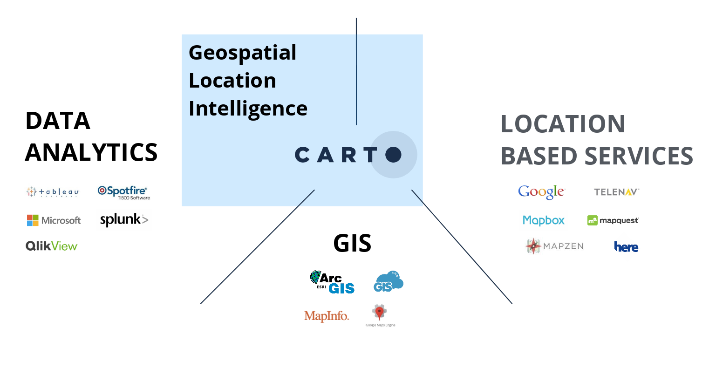
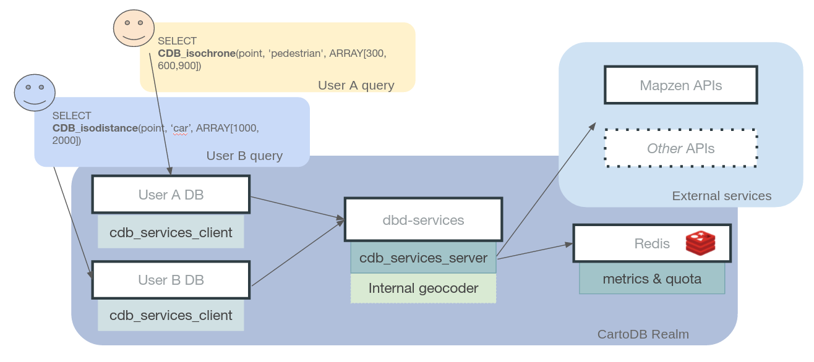
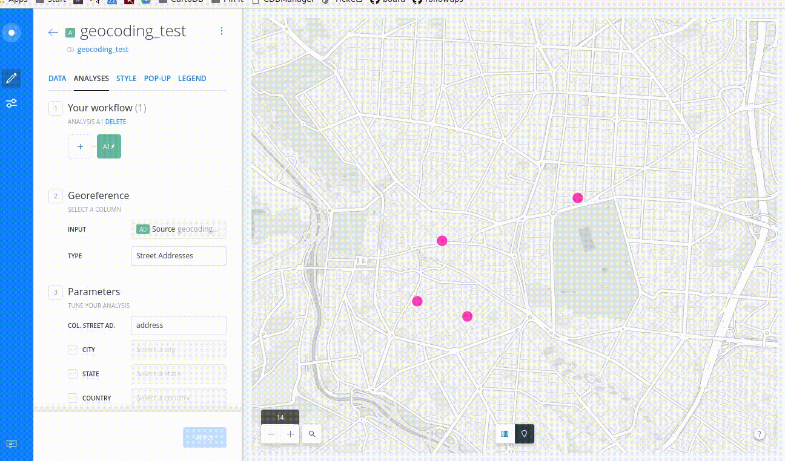

Data Services API
===================================

## *SQL all the things*

Jorge Sanz · [@xurxosanz](http://twitter.com/xurxosanz)

23rd of September 2016 · SoTM · Brussels

http://bit.ly/160923-dataservices


---

## Who am I

* Casual Mapper since 2007
* OSM/HOT advocate
* OSGeo Foundation
* CARTO Solutions Engineer

---
<!-- .element data-background-color="#F24440" class="back-red"-->

## What’s CARTO

* [https://carto.com](https://carto.com)
* Location Intelligence SaaS
* Since 2012
* ~100 people
* Offices in New York, Madrid,<br> Tartu and London
* ~230K users
---


---

<!-- .element data-background-image="./imgs/manhattan.jpg" class="invert-colors"-->

## Our mission

We are **democratizing** location intelligence, enabling geospatial analysis like a data scientist.

With CARTO we want **everybody** analyzing, visualizing and extracting valuable insights on location data.

---
<!-- .element data-background-color="#F24440"-->



---


## Our offering

<ul>
    <li>Allow users to
        <ul>
            <li>Create beautiful visualizations</li>
            <li>Perform better analysis</li>
        </ul>
    </li>
    <li>Expose all Postgres power
        <ul>
            <li>but not only</li>
        </ul>
    </li>
    <li>Open Source and Open Data
        <ul>
            <li><a href="http://github.com/CartoDB">
                http://github.com/CartoDB
            </a></li>
        </ul>
    </li>
</ul>

---

## CARTO and LBS previously

* Our users demand **LBS**
* CARTO **basemaps** and integration <br>with many others (XYZ, WMS,...)
* Simple own **geocoding**: country, place names, etc
* Street level geocoding with **HERE**

---

## Geocoding on the Editor

 <!-- .element style="width:85%;" -->

---

## Focus on the platform

* Moving logic from the **editor**<br> to the **platform**
* New HTTP API?

 <!-- .element class="fragment" style="width:20%" -->

---
<!-- .element data-background-color="#F24440" class="back-red"-->


## *SQL all the things*

> Create an API as SQL functions: <br> **Data Services API**

---

## Data Services API

<!-- .element  style="width:80%;" -->

[>>](https://github.com/CartoDB/dataservices-api/blob/development/client/cdb_dataservices_client--0.11.1.sql#L335)

---
<!-- .element class="slide-smaller-text" -->

## Data Services API

<!-- .element style="width:85%" -->


* Client/Server **separation**
* ***Weak*** dependency on CARTO infrastructure
  * CARTO redis database
  * Not difficult to get rid of it
* **Open** to add more LBS providers

---

## Traditional LBS providers


---
<!-- .element data-background-color="#F24440" -->


---

<!-- .element style="width:60%" -->

https://mapzen.com/blog/cartodb-partnership/

<!-- .element style="width:60%;margin-top:2em;" -->

https://carto.com/blog/location-data-services/
---


## Services wrapped

Geocoding · Routing · Isolines

---

## Geocoding

```sql
INSERT INTO {tablename} (the_geom)
SELECT
    cdb_geocode_street_point(
        '651 Lombard Street',
        'San Francisco',
        'California',
        'United States'
    )
```

---

## Routing

```sql
INSERT INTO {tablename} (duration, length, the_geom)
SELECT duration, length, shape
FROM
    cdb_route_point_to_point(
        'POINT(-3.70237112 40.41706163)'::geometry,
        'POINT(-3.69909883 40.41236875)'::geometry,
        'car'
    )
```

---

## Isolines

```sql
INSERT INTO {tablename} (the_geom) SELECT the_geom
FROM cdb_isodistance(
        'POINT(-3.70568 40.42028)'::geometry,
        'walk',
        ARRAY[500, 1000, 1500]::integer[]
    )

INSERT INTO {tablename} (the_geom) SELECT the_geom
FROM cdb_isochrone(
        'POINT(-3.70568 40.42028)'::geometry,
        'car',
        ARRAY[300, 600, 900]::integer[]
    )
```


---

## CARTO Builder: geocoding


---

## CARTO Builder: isochrones



---

## Use cases for <br>Data Services API

* **Triggers** (adding coords, routes, validations)
* In line analysis with the **Builder**
* **Parametrized** routes rendering (cab ride)

---

## DS API + Named Maps API

<pre style="font-size:0.7em">
https://your_account.carto.com/api/v1/map/named/routingtest/750/400.png?
config={"postcode1":"'<strong>postcode_1</strong>'","postcode2":"'<strong>postcode_2</strong>'"}
</pre>


---

## Wrap up

<ul>
    <li>
        CARTO wants to <strong>democratize</strong><br>
        geospatial analysis
    </li>
    <li class="fragment">
        This includes LBS, and <strong>being open</strong>
        is a <strong>must</strong>
    </li>
    <li class="fragment">
        <strong>Mapzen</strong> services exposed
        as SQL functions<br>
        fits <strong>perfectly</strong> with CARTO proposal</li>
</ul>

---

Thanks!!
===================================

## *SQL all the things*

Jorge Sanz · jorge@carto.com

23rd of September 2016 · SoTM · Brussels

http://bit.ly/160923-dataservices


<!--
RESOURCES

COLORS:

Location Red
#F24440
#FF918F

Navy Blue
#162945

Purple
#C6ACFC
#C6ACFC

Prediction Blue
#1785FB

Green
#73C86B


-->

