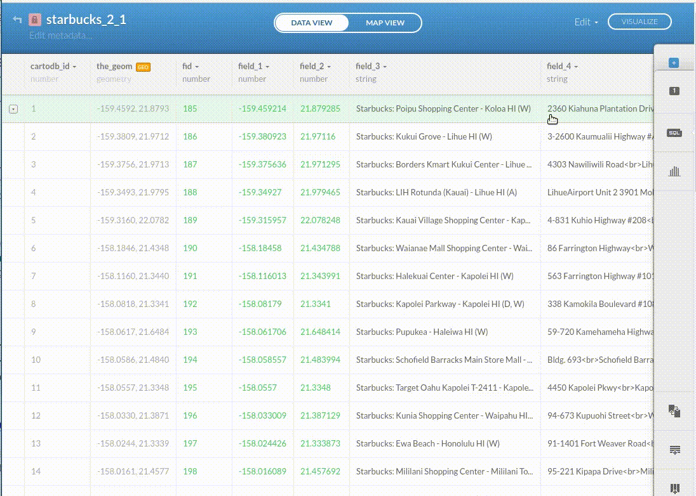
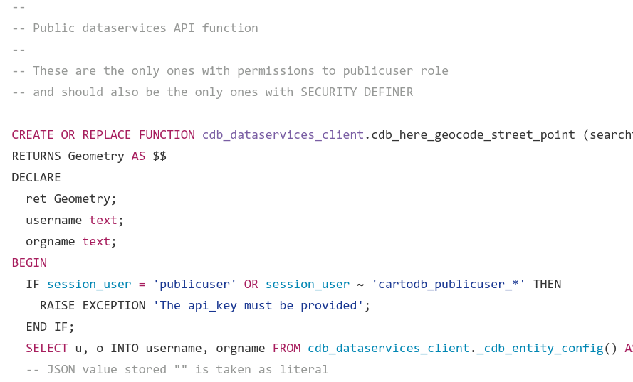
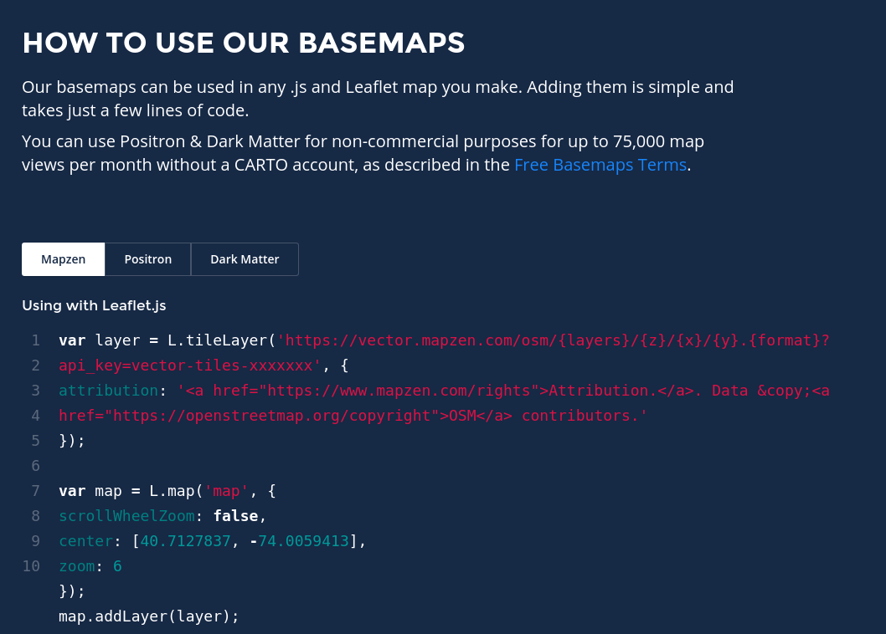
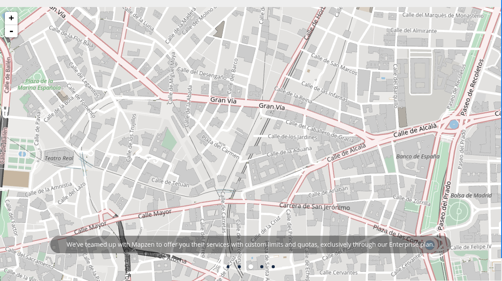
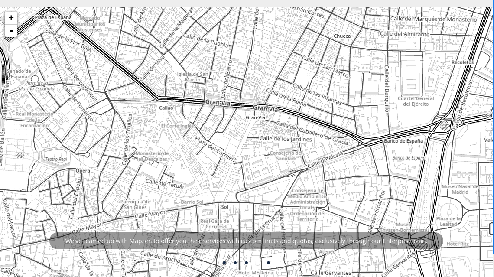
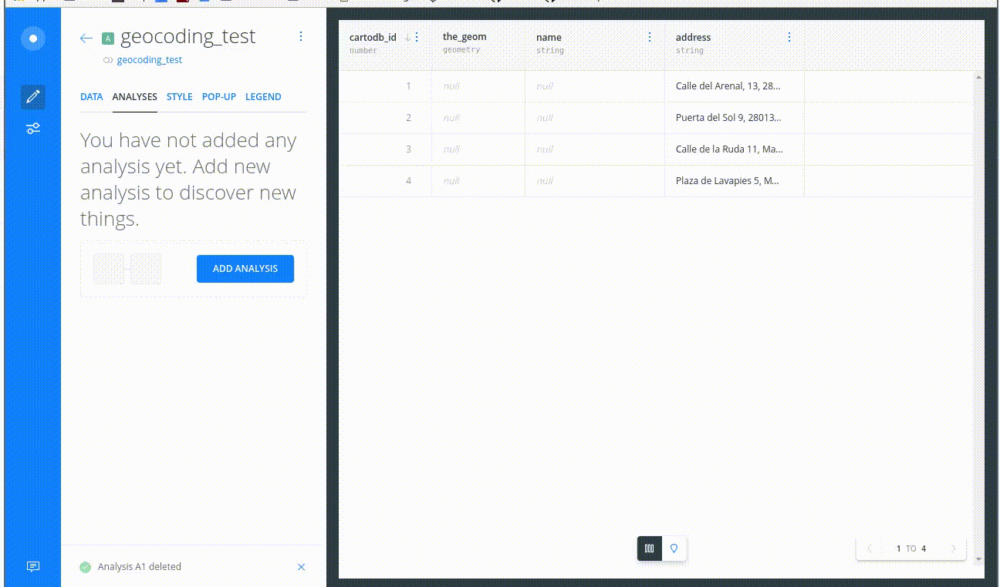

Location Data Services
===================================

Jorge Sanz · [jorge@carto.com](mailto:jorge@carto.com)

October'16 - CartoCamp - Madrid

http://bit.ly/161013-lds


---

## CARTO and LBS previously

* Our users demand **LBS**
* CARTO **basemaps** and integration <br>with many others (XYZ, WMS,...)
* Simple own **geocoding**: country, place names, etc
* Street level geocoding with **HERE**

---

## Geocoding on the Editor

 <!-- .element style="width:85%;" -->

---

## Focus on the platform

* Moving logic from the **editor**<br> to the **platform**
* New HTTP API?

 <!-- .element class="fragment noborder" style="width:20%" -->

---
<!-- .element data-background-color="#F24440" class="back-red"-->


## *SQL all the things*

> Create an API as SQL functions: <br> **Data Services API**

---

## Data Services API

<!-- .element  style="width:80%;" -->

[>>](https://github.com/CartoDB/dataservices-api/blob/development/client/cdb_dataservices_client--0.11.1.sql#L335)

---
<!-- .element class="slide-smaller-text" -->

## Data Services API

<!-- .element style="width:85%" -->


* Client/Server **separation**
* ***Weak*** dependency on CARTO infrastructure
  * CARTO redis database
  * Not difficult to get rid of it
* **Open** to add more LBS providers

---

## Traditional LBS providers


---

<!-- .element style="width:60%" -->

https://mapzen.com/blog/cartodb-partnership/

<!-- .element style="width:60%;margin-top:2em;" -->

https://carto.com/blog/location-data-services/
---

## Basemaps

* **Raster**: positron and dark matter
* **Vector**: Mapzen OSM vector tiles

<!-- .element style="width:60%;" class="noborder" -->

https://carto.com/location-data-services/basemaps/

---

## Raster basemaps

<!-- .element style="width:80%;" -->

https://carto.com/location-data-services/basemaps/

---

## Raster basemaps

<!-- .element style="width:80%;" -->

https://carto.com/location-data-services/basemaps/

---

## Vector basemaps

<!-- .element style="width:80%;" -->

https://carto.com/location-data-services/basemaps/

---

## Vector basemaps

<!-- .element style="width:80%;" -->

https://carto.com/location-data-services/basemaps/

---

## LBS wrapped at the DataServices API

Geocoding · Routing · Isolines

---

## Geocoding

```sql
INSERT INTO {tablename} (the_geom)
SELECT
    cdb_geocode_street_point(
        '651 Lombard Street',
        'San Francisco',
        'California',
        'United States'
    )
```

---

## Routing

```sql
INSERT INTO {tablename} (duration, length, the_geom)
SELECT duration, length, shape
FROM
    cdb_route_point_to_point(
        'POINT(-3.70237112 40.41706163)'::geometry,
        'POINT(-3.69909883 40.41236875)'::geometry,
        'car'
    )
```

---

## Isolines

```sql
INSERT INTO {tablename} (the_geom) SELECT the_geom
FROM cdb_isodistance(
        'POINT(-3.70568 40.42028)'::geometry,
        'walk',
        ARRAY[500, 1000, 1500]::integer[]
    )

INSERT INTO {tablename} (the_geom) SELECT the_geom
FROM cdb_isochrone(
        'POINT(-3.70568 40.42028)'::geometry,
        'car',
        ARRAY[300, 600, 900]::integer[]
    )
```


---

## CARTO Builder: geocoding



---

## CARTO Builder: isochrones


---

## Use cases for <br>Data Services API

* **Triggers** (adding coords, routes, validations)
* In line analysis with the **Builder**
* **Parametrized** routes rendering (cab ride)

---

## DS API + Named Maps API

<pre style="font-size:0.7em">
https://your_account.carto.com/api/v1/map/named/routingtest/750/400.png?
config={"postcode1":"'<strong>postcode_1</strong>'","postcode2":"'<strong>postcode_2</strong>'"}
</pre>


---
<!-- .element data-background-image="./imgs/do.jpg" data-background-color="#162945" data-background-position="right" data-background-size="40% auto" class="left-slide"-->

## Data Observatory

* **Data augmentation** service
* Seamless access to **borders**, **demographics** and **more**
* **Pairing** with your private location data or incorporate into your **analysis workflows**
* Current status: USA, Spain, Mexico, UK, France, Thailand

---

## Data Observatory

Boundaries

```sql
INSERT INTO my_table (the_geom, geo_id)
  SELECT *
  FROM OBS_GetBoundariesByGeometry(
    ST_Buffer(CDB_LatLng(40.7, -73.9), 0.01),
    'es.cnig.ccaa'
  )
```

Measurements

```sql
UPDATE my_table
  SET dwellings_rented =
    OBS_GetMeasure(the_geom, 'es.ine.t18_4');
```

https://carto.com/docs/carto-engine/data/overview/

---

## Data Observatory


---

## Wrap up

* **Basemaps**
  * raster and vector
* **Data Services API**
  * routing, geocoding and isolines
* **Data Observatory**
  * boundaries and measurements

---

Thanks!!
===================================

## Location Data Services

Jorge Sanz · [jorge@carto.com](mailto:jorge@carto.com)

http://bit.ly/161013-lds

October'16 - CartoCamp - Madrid


<!--
RESOURCES

COLORS:

Location Red
#F24440
#FF918F

Navy Blue
#162945

Purple
#C6ACFC
#C6ACFC

Prediction Blue
#1785FB

Green
#73C86B


-->

